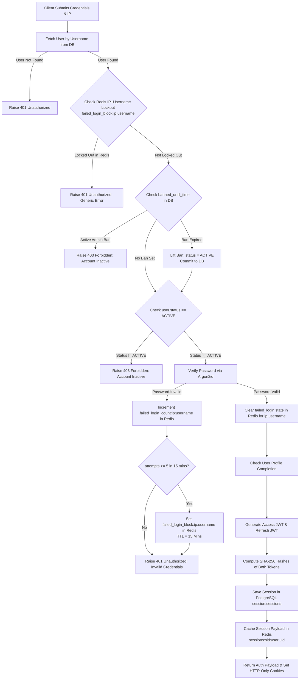

# Authentication & Token Lifecycle Logic Flow

## User Login & IP-Scoped ABAC Lockout Flowchart
This flowchart details credential verification, Argon2id check, IP+Username brute-force lockout, and initial session creation:

---