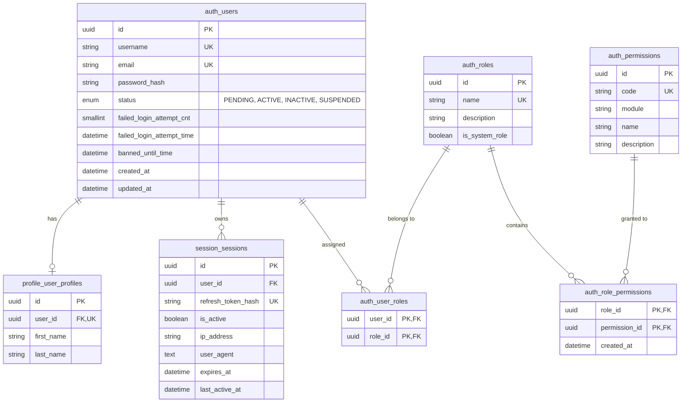

# Hybrid RBAC + ABAC Authorization Model

The authorization model evaluates both **static roles/permissions** and **dynamic contextual attributes**:

```mermaid
erDiagram
    auth_users ||--o{ auth_user_roles : "assigned"
    auth_roles ||--o{ auth_user_roles : "belongs to"
    auth_roles ||--o{ auth_role_permissions : "contains"
    auth_permissions ||--o{ auth_role_permissions : "granted to"
    auth_users ||--o{ session_sessions : "owns"
    auth_users ||--o| profile_user_profiles : "has"

    auth_users {
        uuid id PK
        string username UK
        string email UK
        string password_hash
        enum status "PENDING, ACTIVE, INACTIVE, SUSPENDED"
        smallint failed_login_attempt_cnt
        datetime failed_login_attempt_time
        datetime banned_until_time
        datetime created_at
        datetime updated_at
    }

    auth_roles {
        uuid id PK
        string name UK
        string description
        boolean is_system_role
    }

    auth_permissions {
        uuid id PK
        string code UK
        string module
        string name
        string description
    }

    auth_user_roles {
        uuid user_id PK, FK
        uuid role_id PK, FK
    }

    auth_role_permissions {
        uuid role_id PK, FK
        uuid permission_id PK, FK
        datetime created_at
    }

    session_sessions {
        uuid id PK
        uuid user_id FK
        string refresh_token_hash UK
        boolean is_active
        string ip_address
        text user_agent
        datetime expires_at
        datetime last_active_at
    }

    profile_user_profiles {
        uuid id PK
        uuid user_id FK, UK
        string first_name
        string last_name
    }
```
