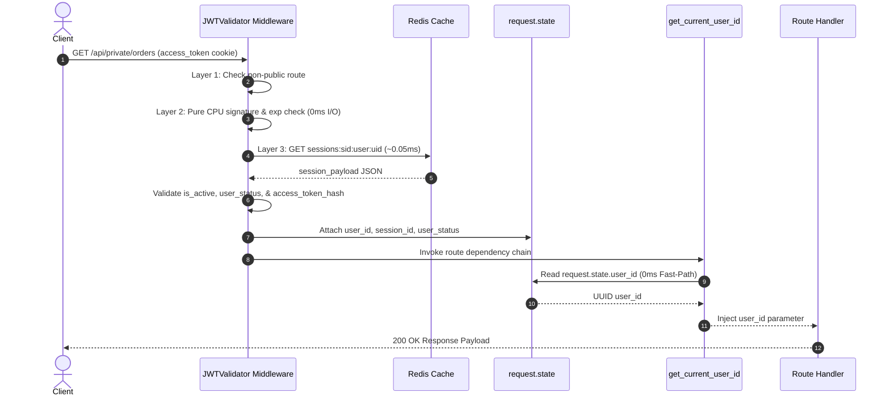

# JWTValidator Middleware Technical Blueprint

## 1. Summary & Design Intention

The `JWTValidator` middleware ([jwt_validator.py](src/middlewares/jwt_validator.py#L16-L183)) is a high-performance, zero-database security guard executing at the request edge for all private routes.

### Primary Goals
- **Zero Database Overhead (0ms DB I/O)**: Eliminates SQL database queries from private route authentication. Signature checks are performed purely in CPU memory, followed by an $O(1)$ Redis session check **0.05ms**.
- **Instant Revocation & Stale Token Mitigation**: Verifies session active status, instant account suspension state, and single-active access token hashes against Redis on every private request.
- **Zero-Latency Downstream Execution**: Pre-verified JWT claims are injected directly into FastAPI `request.state`. Downstream route handlers and dependencies ([get_current_user_id](src/dependencies/current_user.py#L25-L26)) read claims from `request.state` with 0ms performance overhead.

## 2. Architectural Position & Request Lifecycle

`JWTValidator` extends Starlette `BaseHTTPMiddleware` and is registered globally in FastAPI `main.py`. It executes before any route handler or dependency function:

```
[ Client Request ]
       │
       ▼
┌────────────────────────────────────────────────────────────────────────┐
│ JWTValidator Middleware (src/middlewares/jwt_validator.py)             │
│                                                                        │
│  Layer 1: Path & Route Guard                                           │
│    └─► Path starts with /api/public or in public_excluded_paths?       │
│          ├─► YES ──► Pass request directly to endpoint                 │
│          └─► NO  ──► Continue to Layer 2                               │
│                                                                        │
│  Layer 2: Pure CPU Cryptographic Guard (0ms I/O)                      │
│    ├─► Extract Authorization header (Bearer) or access_token cookie   │
│    ├─► Decode HMAC-SHA256 signature using ACCESS_JWT_SECRET_KEY        │
│    └─► Verify claim type == "access-token" & check expiry (exp)        │
│                                                                        │
│  Layer 3: Redis Session & Account Validation Guard (O(1) ~0.05ms)      │
│    ├─► Fetch Redis key: sessions:{sid}:user:{uid}                      │
│    ├─► Check 3.1: Session is_active == True                            │
│    ├─► Check 3.2: User user_status == "ACTIVE"                         │
│    └─► Check 3.3: SHA-256 access_token_hash matches incoming token    │
│                                                                        │
│  Context Injection                                                     │
│    └─► Inject claims into request.state (user_id, session_id, etc.)    │
└────────────────────────────────────────────────────────────────────────┘
       │
       ▼ (0ms Overhead)
┌────────────────────────────────────────────────────────────────────────┐
│ Downstream Route Handler / Dependency (dependencies/current_user.py)   │
└────────────────────────────────────────────────────────────────────────┘

```

---

## 3. Middleware-to-Route Context Sequence Diagram
Interaction between Client, JWTValidator Middleware, Redis Cache, `request.state`, and FastAPI Route Dependencies:



---
