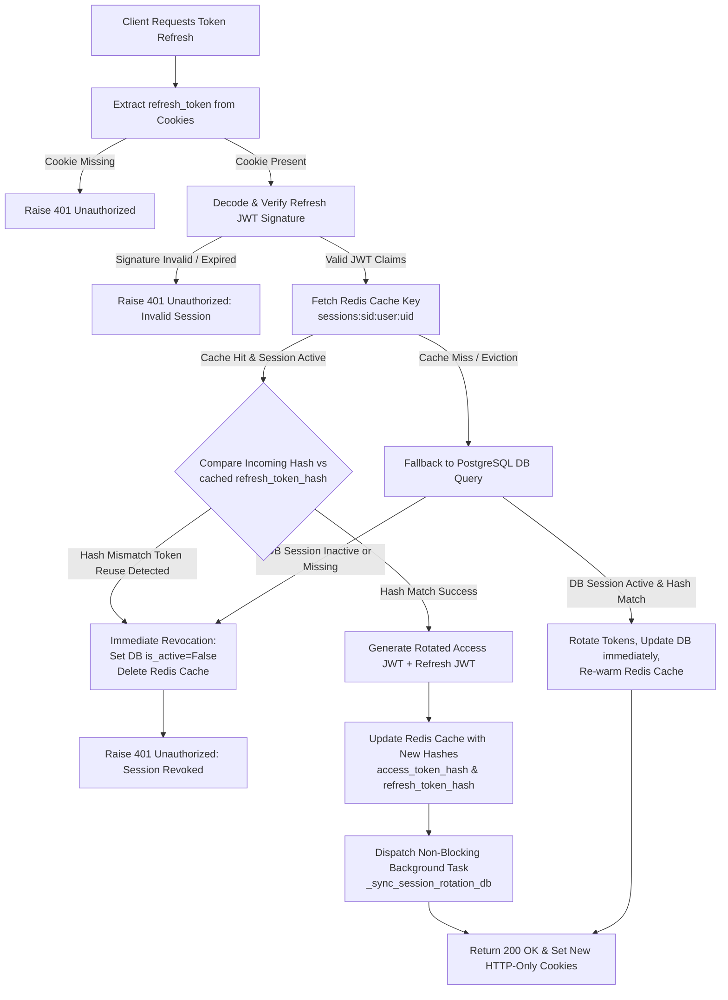

# Refresh Token Rotation (RTR) & Fast-Path DB Sync Flowchart
This diagram illustrates the single-authoritative Redis validation path, token rotation, theft detection, and non-blocking background DB sync:

---
