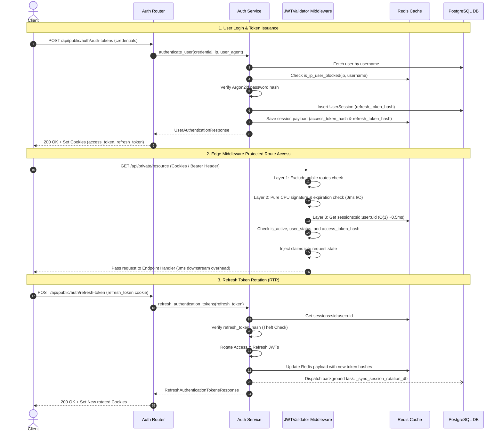

# Authentication & Protected Route Request Sequence
End-to-end interaction flow across Client Browser, FastAPI Router, Auth Service, JWTValidator Middleware, PostgreSQL, and Redis Cache:

```mermaid
sequenceDiagram
    autonumber
    actor Client
    participant Router as Auth Router
    participant Service as Auth Service
    participant MW as JWTValidator Middleware
    participant Cache as Redis Cache
    participant DB as PostgreSQL DB

    Note over Client, DB: 1. User Login & Token Issuance
    Client->>Router: POST /api/public/auth/auth-tokens (credentials)
    Router->>Service: authenticate_user(credential, ip, user_agent)
    Service->>DB: Fetch user by username
    Service->>Cache: Check is_ip_user_blocked(ip, username)
    Service->>Service: Verify Argon2id password hash
    Service->>DB: Insert UserSession (refresh_token_hash)
    Service->>Cache: Save session payload (access_token_hash & refresh_token_hash)
    Service-->>Router: UserAuthenticationResponse
    Router-->>Client: 200 OK + Set Cookies (access_token, refresh_token)

    Note over Client, DB: 2. Edge Middleware Protected Route Access
    Client->>MW: GET /api/private/resource (Cookies / Bearer Header)
    MW->>MW: Layer 1: Exclude public routes check
    MW->>MW: Layer 2: Pure CPU signature & expiration check (0ms I/O)
    MW->>Cache: Layer 3: Get sessions:sid:user:uid (O(1) ~0.5ms)
    MW->>MW: Check is_active, user_status, and access_token_hash
    MW->>MW: Inject claims into request.state
    MW-->>Client: Pass request to Endpoint Handler (0ms downstream overhead)

    Note over Client, DB: 3. Refresh Token Rotation (RTR)
    Client->>Router: POST /api/public/auth/refresh-token (refresh_token cookie)
    Router->>Service: refresh_authentication_tokens(refresh_token)
    Service->>Cache: Get sessions:sid:user:uid
    Service->>Service: Verify refresh_token_hash (Theft Check)
    Service->>Service: Rotate Access & Refresh JWTs
    Service->>Cache: Update Redis payload with new token hashes
    Service--)DB: Dispatch background task: _sync_session_rotation_db
    Service-->>Router: RefreshAuthenticationTokensResponse
    Router-->>Client: 200 OK + Set New rotated Cookies
```

---