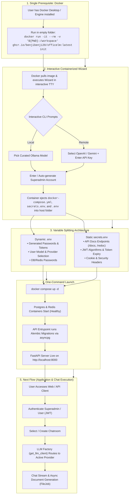

# OfficeLM Setup & Lifecycle Pipeline
`v1.0`

> **Core Philosophy**: **Docker is the ONLY prerequisite.** The user does not need Python, uv, pip, Git, or compilers installed on their host machine.

---

## 1. End-to-End Architecture Flow

---

## Connection to Next Flow (Application & Chat Engine)
1. **Authentication**: Users authenticate against `POST /auth/login` using the initial admin or registered accounts, obtaining JWT access & refresh tokens.
2. **Chatroom Management**: Users create or re-enter chatrooms (`chat.chat_rooms`).
3. **Provider-Agnostic LLM Routing**: Application services call `get_llm_client()` / `get_embedding_client()`. The factory reads `LLM_PROVIDER` from `.env` and serves streaming chat responses or vector embeddings without importing concrete provider SDKs.
4. **Document Generation**: Messages triggering document creation spawn asynchronous `FileJob` tasks for formatting and exporting Markdown, Word, Excel, and PDF files.
