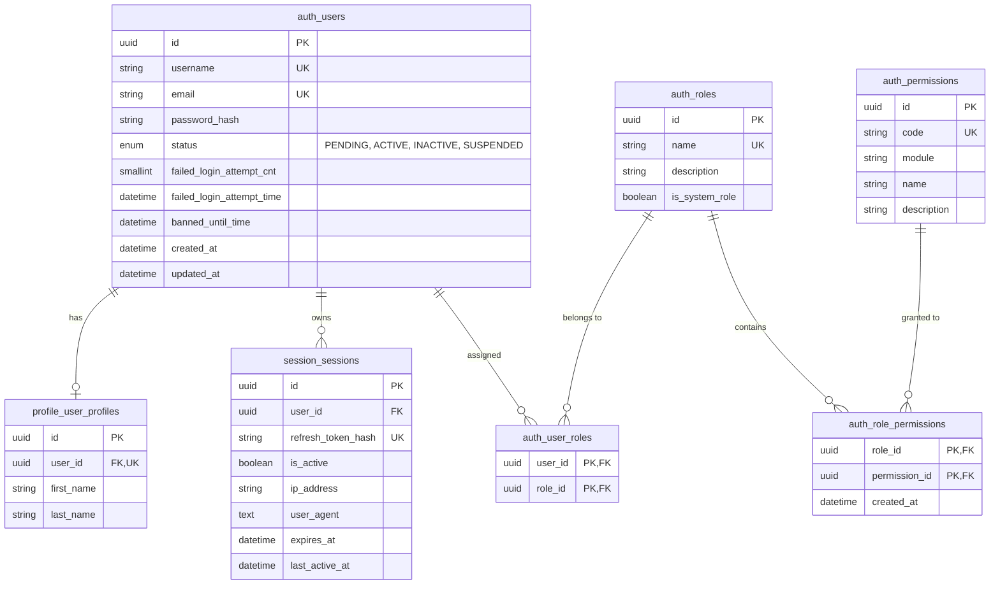
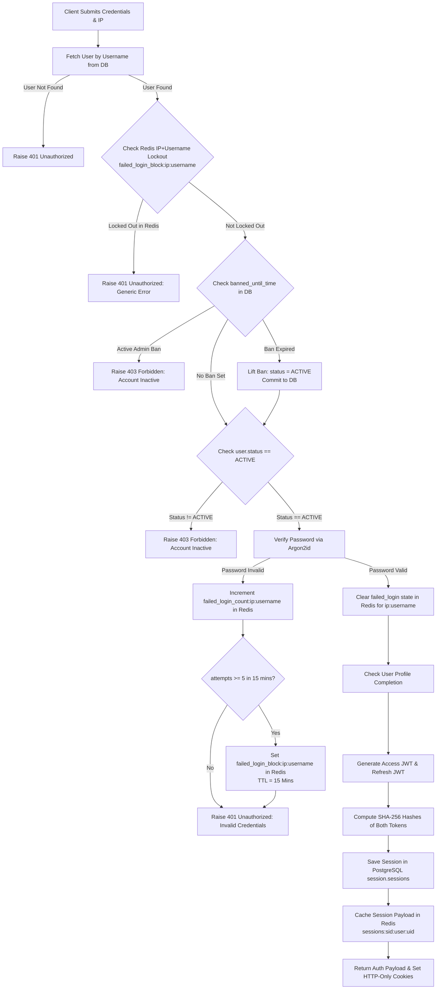
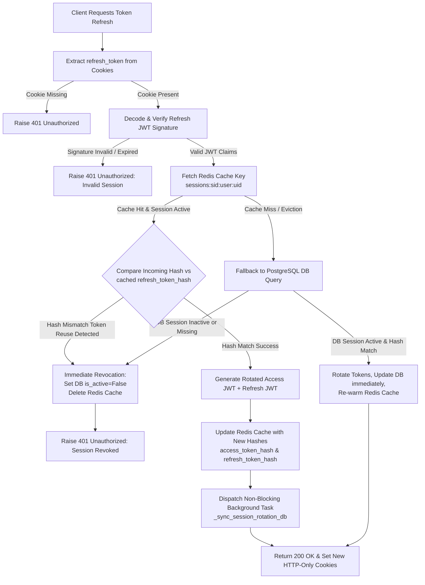
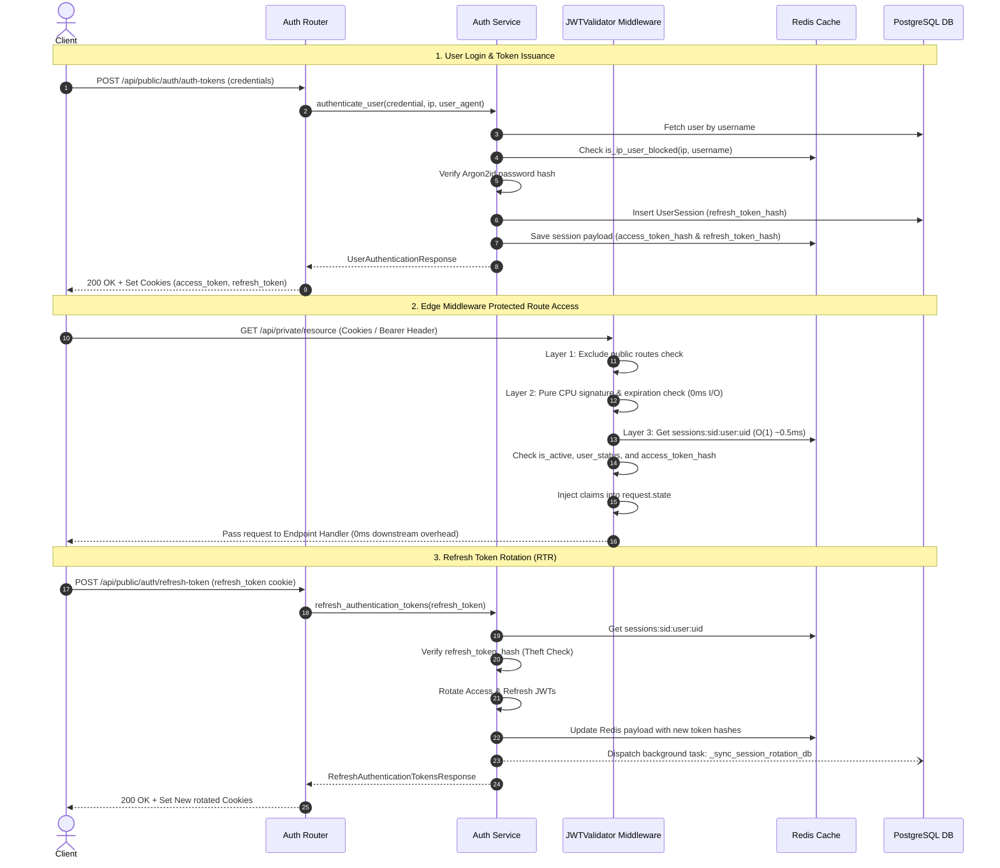

# Authentication & Authorization System Technical Blueprint

> **System Architecture & Developer Reference Document**  
> **Date & Time Written**: August 16, 2026 at 5:00 PM
> **Document Status**: Production / Boilerplate Standard  
> **Coverage**: Authentication, Hybrid RBAC + ABAC Authorization, Refresh Token Rotation (RTR), Fast-Path Redis Session Verification, Asynchronous DB Throttling, IP-Scoped Brute-Force Mitigation  
> **Exclusions**: Test Suites (`tests/`), Registration (Unchanged)  

---

## 1. Executive Summary & Design Intention

This authentication and authorization subsystem is designed as an enterprise-grade, defense-in-depth foundation for FastAPI applications. It is engineered to serve as a reusable production template to prevent boilerplate rewrite across future projects.

### Core Architectural Principles
- **Defense in Depth**: Authentication checks occur at both the network edge (IP-based rate limiting), middleware layer ([JWTValidator](file:///c:/Users/imper/Documents/csi/erp/src/middlewares/jwt_validator.py#L16-L183) for 0ms CPU verification + O(1) Redis session checks), controller/router layer (HTTP-Only cookie parsing & JWT validation), service layer (ABAC status checks, Argon2id verification, granular IP+Username lockout), and persistence layer (SHA-256 hashed tokens).
- **Refresh Token Rotation (RTR) & Instant Invalidation**: On every token refresh request (`POST /api/public/auth/refresh-token`), **both** access and refresh tokens are rotated. Presenting an old or previously used refresh token triggers automatic reuse detection, immediately revoking the session across PostgreSQL and Redis.
- **Database I/O Throttling (Fast-Path Architecture)**: Token refresh operations validate against a single authoritative Redis cache in **0.5ms**. Database updates (rotating hashes and timestamp synchronization) are offloaded to non-blocking background tasks (`asyncio.create_task`) using dedicated async sessions (`postgres_client_async_session`), eliminating DB I/O overhead from the request-response hot path.
- **Granular IP + Username Lockout Model**: Brute-force protection tracks failed attempts per `(IP, Username)` pair in Redis. Blocking 5 failed attempts locks out only the offending IP-username combination, preventing cross-IP Denial of Service (DoS) attacks on legitimate users.
- **Zero Raw Secret Exposure**: Plaintext passwords are never stored; they are hashed using **Argon2id** via `pwdlib`. Both access and refresh tokens are hashed using SHA-256 before storage in session payloads and database tables.

---

## 2. Architectural Layer & Component Map

The authentication system is structured into strict architectural layers located under `src/`:

| Layer | Primary Files | Key Responsibilities & Line References |
| :--- | :--- | :--- |
| **API Routers** | [auth_router.py](file:///c:/Users/imper/Documents/csi/erp/src/modules/authentication/auth_router.py) | Exposes public auth endpoints, sets HTTP-Only cookies for access & refresh tokens, extracts request headers (`X-Forwarded-For`, `User-Agent`). See [auth_router.py:L19-L134](file:///c:/Users/imper/Documents/csi/erp/src/modules/authentication/auth_router.py#L19-L134). |
| **Service Layer** | [auth_service.py](file:///c:/Users/imper/Documents/csi/erp/src/modules/authentication/auth_service.py) | Orchestrates Argon2id password hashing, IP+Username brute-force lockout, dual JWT generation, session creation, Refresh Token Rotation (RTR), and background DB sync. See [auth_service.py:L32-L638](file:///c:/Users/imper/Documents/csi/erp/src/modules/authentication/auth_service.py#L32-L638). |
| **Edge Middleware** | [jwt_validator.py](file:///c:/Users/imper/Documents/csi/erp/src/middlewares/jwt_validator.py) | Zero-DB, 3-layer validation middleware injecting pre-verified claims into `request.state` for private routes. See [jwt_validator.py:L16-L183](file:///c:/Users/imper/Documents/csi/erp/src/middlewares/jwt_validator.py#L16-L183). |
| **Security Guards** | [current_user.py](file:///c:/Users/imper/Documents/csi/erp/src/dependencies/current_user.py) | FastAPI dependencies for protected endpoints: `get_current_user_id` ([L17-L68](file:///c:/Users/imper/Documents/csi/erp/src/dependencies/current_user.py#L17-L68)) leveraging `request.state`, and ABAC profile completion guard `require_user_profile_and_get_id` ([L70-L108](file:///c:/Users/imper/Documents/csi/erp/src/dependencies/current_user.py#L70-L108)). |
| **Domain Models** | [auth_model.py](file:///c:/Users/imper/Documents/csi/erp/src/modules/authentication/auth_model.py)<br>[session_model.py](file:///c:/Users/imper/Documents/csi/erp/src/modules/session/session_model.py) | SQLAlchemy ORM models for users, roles, permissions, junction tables, and session audit logs. See [auth_model.py:L26-L174](file:///c:/Users/imper/Documents/csi/erp/src/modules/authentication/auth_model.py#L26-L174) & [session_model.py:L15-L46](file:///c:/Users/imper/Documents/csi/erp/src/modules/session/session_model.py#L15-L46). |
| **Repositories** | [auth_repository.py](file:///c:/Users/imper/Documents/csi/erp/src/modules/authentication/auth_repository.py)<br>[session_repo.py](file:///c:/Users/imper/Documents/csi/erp/src/modules/session/session_repo.py) | Async database access abstractions for user credentials and active session state. |
| **Enums & Constants** | [enums.py](file:///c:/Users/imper/Documents/csi/erp/src/shares/enums.py) | Standardized system permission strings formatted as `MODULE:RESOURCE:ACTION`. See [enums.py:L9-L62](file:///c:/Users/imper/Documents/csi/erp/src/shares/enums.py#L9-L62). |
| **Cache Utilities** | [maintain_cache_key.py](file:///c:/Users/imper/Documents/csi/erp/src/utils/maintain_cache_key.py) | Redis key generators, IP+Username failed login tracking, and profile completion status caching. See [maintain_cache_key.py:L8-L92](file:///c:/Users/imper/Documents/csi/erp/src/utils/maintain_cache_key.py#L8-L92). |

---

## 3. Hybrid RBAC + ABAC Authorization Model

The authorization model evaluates both **static roles/permissions** and **dynamic contextual attributes**:



### Role-Based Access Control (RBAC) Mechanics
- **Permissions**: Defined in [Permission](file:///c:/Users/imper/Documents/csi/erp/src/modules/authentication/auth_model.py#L34-L51). Formatted programmatically in [SystemPermission](file:///c:/Users/imper/Documents/csi/erp/src/shares/enums.py#L43-L62) as `MODULE:RESOURCE:ACTION` (e.g., `AUTHENTICATION:USER:CREATE`).
- **Roles**: Groups of permissions defined in [Role](file:///c:/Users/imper/Documents/csi/erp/src/modules/authentication/auth_model.py#L77-L101) (e.g., `SUPER_ADMIN`, `ADMIN`, `STAFF_USER`).
- **Junction Tables**: [RolePermission](file:///c:/Users/imper/Documents/csi/erp/src/modules/authentication/auth_model.py#L54-L75) and [UserRole](file:///c:/Users/imper/Documents/csi/erp/src/modules/authentication/auth_model.py#L103-L119) implement M:N relationships loaded via `lazy="selectin"`.

### Attribute-Based Access Control (ABAC) Mechanics
In addition to RBAC roles, every access decision evaluates contextual attributes:
1. **User Status Attribute** ([UserStatus](file:///c:/Users/imper/Documents/csi/erp/src/modules/authentication/auth_model.py#L26-L32)): Access is denied unless `user.status == UserStatus.ACTIVE` ([auth_service.py:L166-L170](file:///c:/Users/imper/Documents/csi/erp/src/modules/authentication/auth_service.py#L166-L170)).
2. **Temporal Ban Expiration Attribute**: Evaluated dynamically at runtime ([auth_service.py:L153-L165](file:///c:/Users/imper/Documents/csi/erp/src/modules/authentication/auth_service.py#L153-L165)). If `banned_until_time` has expired, the system automatically restores a `SUSPENDED` account back to `ACTIVE`.
3. **Granular IP + Username Lockout Attribute**: Pre-authentication brute-force check ([auth_service.py:L144-L151](file:///c:/Users/imper/Documents/csi/erp/src/modules/authentication/auth_service.py#L144-L151)). Checks Redis key `failed_login_block:{ip}:{username}`. 5 consecutive failed attempts from the same IP set a 15-minute lockout for that specific IP-username pair.
4. **Environment Attributes**: Client IP and User-Agent are recorded in `session.sessions` ([session_model.py:L35-L36](file:///c:/Users/imper/Documents/csi/erp/src/modules/session/session_model.py#L35-L36)).
5. **Profile Completion Attribute**: Enforced dynamically by dependency `require_user_profile_and_get_id` ([current_user.py:L70-L108](file:///c:/Users/imper/Documents/csi/erp/src/dependencies/current_user.py#L70-L108)), returning HTTP 403 `PROFILE_SETUP_REQUIRED` if false.

---

## 4. Authentication & Token Lifecycle Logic Flow

### Diagram 1: User Login & IP-Scoped ABAC Lockout Flowchart
This flowchart details credential verification, Argon2id check, IP+Username brute-force lockout, and initial session creation:



---

### Diagram 2: Refresh Token Rotation (RTR) & Fast-Path DB Sync Flowchart
This diagram illustrates the single-authoritative Redis validation path, token rotation, theft detection, and non-blocking background DB sync:



---

### Diagram 3: Authentication & Protected Route Request Sequence
End-to-end interaction flow across Client Browser, FastAPI Router, Auth Service, JWTValidator Middleware, PostgreSQL, and Redis Cache:



---

## 5. Session Cache Payload Specification

The Redis key `sessions:{session_id}:user:{user_id}` contains a complete, self-contained JSON session payload ([auth_service.py:L499-L527](file:///c:/Users/imper/Documents/csi/erp/src/modules/authentication/auth_service.py#L499-L527)):

| Field Name | Type | Description & Purpose |
| :--- | :--- | :--- |
| `id` | `string (UUID)` | Unique session identifier (`sid`). |
| `user_id` | `string (UUID)` | User account identifier (`sub`). |
| `refresh_token_hash` | `string (SHA-256)` | Hash of currently active refresh token. Used for RTR theft detection. |
| `access_token_hash` | `string (SHA-256)` | Hash of currently active access token. Used by `JWTValidator` to reject stale access tokens. |
| `is_active` | `boolean` | Session active state flag. Checked by middleware layer. |
| `user_status` | `string` | User account lifecycle status (`ACTIVE`, `SUSPENDED`, `PENDING`, `INACTIVE`). |
| `is_profile_completed` | `boolean` | Flag indicating whether user profile setup is complete. |
| `ip_address` | `string / null` | Client IP address at login. |
| `user_agent` | `string / null` | Client User-Agent header string. |
| `expires_at` | `ISO 8601 string` | Refresh token expiration timestamp. |
| `last_active_at` | `ISO 8601 string` | Last request timestamp. |
| `last_db_synced_at` | `ISO 8601 string` | Timestamp of last asynchronous database synchronization. |

---

## 6. API Endpoints Specification

### 1. User Registration
- **Endpoint**: `POST /api/public/auth/registration`
- **Location**: [auth_router.py:L20-L32](file:///c:/Users/imper/Documents/csi/erp/src/modules/authentication/auth_router.py#L20-L32)
- **Access**: Public (Protected by IP Rate Limiter)
- **Input**: `UserRegistrationRequest` (`username`, `email`, `plain_password`)
- **Behavior**: Standardizes email to lowercase, checks email uniqueness, hashes password with Argon2id, creates `User` record with default `status = UserStatus.PENDING`. Unchanged.

### 2. User Authentication & Token Grant
- **Endpoint**: `POST /api/public/auth/auth-tokens`
- **Location**: [auth_router.py:L37-L91](file:///c:/Users/imper/Documents/csi/erp/src/modules/authentication/auth_router.py#L37-L91)
- **Access**: Public (Protected by IP Rate Limiter)
- **Input**: `UserAuthenticationRequest` (`username`, `plain_password`)
- **Behavior**: Checks IP+Username Redis lockout, verifies Argon2id password, generates dual JWTs, computes SHA-256 token hashes, persists session in PostgreSQL & Redis, returns payload and sets HTTP-Only cookies.
- **Cookies Set**:
  - `access_token`: Max-Age = `ACCESS_JWT_EXPIRY_SEC`, Path = `/`, HttpOnly = `True`, Secure = `True` (dev override), SameSite = `lax`/`strict`.
  - `refresh_token`: Max-Age = `REFRESH_JWT_EXPIRY_SEC`, Path = `/api/public/auth`, HttpOnly = `True`, Secure = `True`, SameSite = `lax`/`strict`.

### 3. Refresh Tokens (RTR Rotation)
- **Endpoint**: `POST /api/public/auth/refresh-token`
- **Location**: [auth_router.py:L95-L133](file:///c:/Users/imper/Documents/csi/erp/src/modules/authentication/auth_router.py#L95-L133)
- **Access**: Public (Protected by IP Rate Limiter)
- **Behavior**: Extracts `refresh_token` from HTTP-Only cookie, verifies JWT signature, validates against Redis cache (`sessions:{sid}:user:{uid}`), verifies token hash for theft detection, rotates **both** access and refresh tokens, updates Redis payload instantly, dispatches background task `_sync_session_rotation_db`, and returns new rotated cookies.

---

## 7. Security Mechanics & Technicalities

### Cryptographic Algorithms
1. **Password Hashing**: Argon2id via `pwdlib.PasswordHash.recommended()` ([auth_service.py:L33](file:///c:/Users/imper/Documents/csi/erp/src/modules/authentication/auth_service.py#L33)). Hashing/verification offloaded to thread pool via `asyncio.to_thread` ([auth_service.py:L70](file:///c:/Users/imper/Documents/csi/erp/src/modules/authentication/auth_service.py#L70), [L173](file:///c:/Users/imper/Documents/csi/erp/src/modules/authentication/auth_service.py#L173)).
2. **Token Hashing**: SHA-256 via `hashlib.sha256(token.encode()).hexdigest()` for both access tokens ([auth_service.py:L211](file:///c:/Users/imper/Documents/csi/erp/src/modules/authentication/auth_service.py#L211)) and refresh tokens ([auth_service.py:L210](file:///c:/Users/imper/Documents/csi/erp/src/modules/authentication/auth_service.py#L210)).
3. **Dual JWT Keys**: Access and Refresh tokens use independent secret keys (`settings.ACCESS_JWT_SECRET_KEY` and `settings.REFRESH_JWT_SECRET_KEY`) encoded using HMAC-SHA256 (`HS256`).

---

## 8. Developer & AI Agent Quick Reference Guide

### Protecting a New Endpoint
To protect a new private endpoint, rely on [current_user.py](file:///c:/Users/imper/Documents/csi/erp/src/dependencies/current_user.py) which automatically uses pre-verified claims from `request.state` injected by [JWTValidator](file:///c:/Users/imper/Documents/csi/erp/src/middlewares/jwt_validator.py#L16-L183):

```python
from fastapi import APIRouter, Depends
from uuid import UUID
from dependencies.current_user import get_current_user_id, require_user_profile_and_get_id

router = APIRouter()

# Option A: Require Valid Authentication Only (0ms overhead)
@router.get("/api/private/resource")
async def get_resource(user_id: UUID = Depends(get_current_user_id)):
    return {"user_id": str(user_id)}

# Option B: Require Valid Authentication AND Completed Profile
@router.get("/api/private/profile-resource")
async def get_profile_resource(user_id: UUID = Depends(require_user_profile_and_get_id)):
    return {"user_id": str(user_id)}
```

### Key Configuration Variables
Defined in [settings.py](file:///c:/Users/imper/Documents/csi/erp/src/core/settings.py):
- `ACCESS_JWT_SECRET_KEY`: Secret string for access token signing.
- `REFRESH_JWT_SECRET_KEY`: Secret string for refresh token signing.
- `ACCESS_JWT_EXPIRY_SEC`: Access token lifespan (e.g. 900s / 15 mins).
- `REFRESH_JWT_EXPIRY_SEC`: Refresh token lifespan (e.g. 604800s / 7 days).
- `COOKIE_SECURE`: `True` in production (enforces HTTPS), `False` in local dev.
- `COOKIE_SAMESITE`: SameSite cookie policy (`lax` or `strict`).
