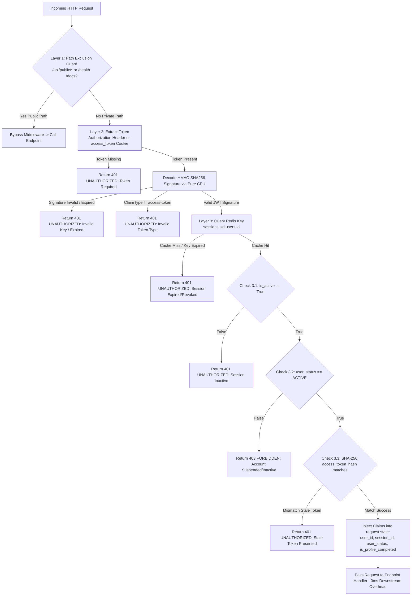
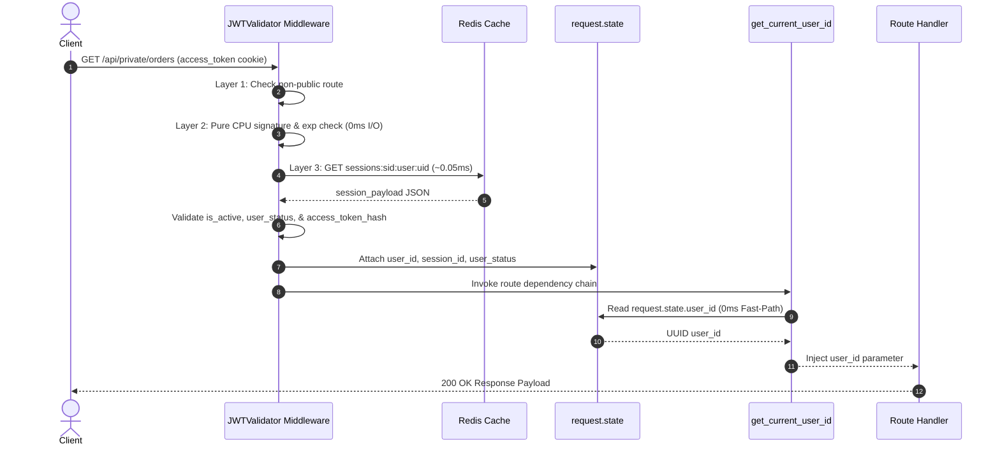

# JWTValidator Middleware Technical Blueprint

> **System Architecture & Developer Reference Document**  
> **Date & Time Written**: August 19, 2026 at 5:03 PM
> **Document Status**: Production / Boilerplate Standard  
> **Target Module**: `src/middlewares/jwt_validator.py`  
> **Coverage**: Zero-DB Edge Middleware, 3-Layer Validation Pipeline, Pure CPU Cryptographic Guard, Single-Active Token Hash Check, Request Context Injection (`request.state`)  

---

## 1. Executive Summary & Design Intention

The `JWTValidator` middleware ([jwt_validator.py](file:///c:/Users/imper/Documents/csi/erp/src/middlewares/jwt_validator.py#L16-L183)) is a high-performance, zero-database security guard executing at the request edge for all private routes.

### Primary Goals
- **Zero Database Overhead (0ms DB I/O)**: Eliminates SQL database queries from private route authentication. Signature checks are performed purely in CPU memory, followed by an $O(1)$ Redis session check **0.05ms**.
- **Instant Revocation & Stale Token Mitigation**: Verifies session active status, instant account suspension state, and single-active access token hashes against Redis on every private request.
- **Zero-Latency Downstream Execution**: Pre-verified JWT claims are injected directly into FastAPI `request.state`. Downstream route handlers and dependencies ([get_current_user_id](file:///c:/Users/imper/Documents/csi/erp/src/dependencies/current_user.py#L25-L26)) read claims from `request.state` with 0ms performance overhead.

---

## 2. Architectural Position & Request Lifecycle

`JWTValidator` extends Starlette `BaseHTTPMiddleware` and is registered globally in FastAPI `main.py`. It executes before any route handler or dependency function:

```
[ Client Request ]
       │
       ▼
┌────────────────────────────────────────────────────────────────────────┐
│ JWTValidator Middleware (src/middlewares/jwt_validator.py)             │
│                                                                        │
│  Layer 1: Path & Route Guard                                           │
│    └─► Path starts with /api/public or in public_excluded_paths?       │
│          ├─► YES ──► Pass request directly to endpoint                 │
│          └─► NO  ──► Continue to Layer 2                               │
│                                                                        │
│  Layer 2: Pure CPU Cryptographic Guard (0ms I/O)                      │
│    ├─► Extract Authorization header (Bearer) or access_token cookie   │
│    ├─► Decode HMAC-SHA256 signature using ACCESS_JWT_SECRET_KEY        │
│    └─► Verify claim type == "access-token" & check expiry (exp)        │
│                                                                        │
│  Layer 3: Redis Session & Account Validation Guard (O(1) ~0.05ms)      │
│    ├─► Fetch Redis key: sessions:{sid}:user:{uid}                      │
│    ├─► Check 3.1: Session is_active == True                            │
│    ├─► Check 3.2: User user_status == "ACTIVE"                         │
│    └─► Check 3.3: SHA-256 access_token_hash matches incoming token    │
│                                                                        │
│  Context Injection                                                     │
│    └─► Inject claims into request.state (user_id, session_id, etc.)    │
└────────────────────────────────────────────────────────────────────────┘
       │
       ▼ (0ms Overhead)
┌────────────────────────────────────────────────────────────────────────┐
│ Downstream Route Handler / Dependency (dependencies/current_user.py)   │
└────────────────────────────────────────────────────────────────────────┘
```

---

## 3. The 3-Layer Validation Architecture

### Layer 1: Path & Route Exclusion Guard
- **Source Code**: [jwt_validator.py:L48-L51](file:///c:/Users/imper/Documents/csi/erp/src/middlewares/jwt_validator.py#L48-L51)
- **Logic**: Checks `request.url.path`.
  - If `req_path.startswith("/api/public")` or `req_path` is in `self.public_excluded_paths` (`/health`, `/docs`, `/redoc`, `/openapi.json`), the request immediately bypasses validation and proceeds to `call_next(request)`.

### Layer 2: Pure CPU Cryptographic Signature & Expiry Guard (0ms I/O)
- **Source Code**: [jwt_validator.py:L56-L112](file:///c:/Users/imper/Documents/csi/erp/src/middlewares/jwt_validator.py#L56-L112)
- **Token Extraction**:
  1. Header check: `Authorization: Bearer <token>`
  2. Fallback: `access_token` HTTP-Only cookie.
  3. If token is missing -> Returns HTTP 401 `UNAUTHORIZED`.
- **Pure CPU Verification**:
  - Decodes token using `jwt.decode` with `settings.ACCESS_JWT_SECRET_KEY` and `settings.JWT_ALGORITHM`.
  - Validates `ExpiredSignatureError` -> Returns HTTP 401 `UNAUTHORIZED`.
  - Validates `type == "access-token"` -> Returns HTTP 401 `UNAUTHORIZED`.
  - Extracts claims: `sub` (User UUID) and `sid` (Session UUID).

### Layer 3: Redis Session & Account Validation Guard (O(1) ~0.05ms)
- **Source Code**: [jwt_validator.py:L117-L165](file:///c:/Users/imper/Documents/csi/erp/src/middlewares/jwt_validator.py#L117-L165)
- Performs an $O(1)$ async lookup in Redis for key `sessions:{session_id}:user:{user_id}`:
  1. **Cache Miss Check**: If key does not exist in Redis (session revoked or expired) -> Returns HTTP 401 `UNAUTHORIZED` ("Session has expired or been revoked").
  2. **Validation 3.1 (Session Active Check)**: Verifies `session_payload.get("is_active") == True`. If `False` -> Returns HTTP 401 `UNAUTHORIZED`.
  3. **Validation 3.2 (User Account Status Check)**: Verifies `session_payload.get("user_status") == "ACTIVE"`. If `SUSPENDED`, `PENDING`, or `INACTIVE` -> Returns HTTP 403 `FORBIDDEN` ("Account is suspended. Access forbidden").
  4. **Validation 3.3 (Single Active Access Token Check)**: Computes `incoming_at_hash = hashlib.sha256(token.encode()).hexdigest()`. Compares against `session_payload.get("access_token_hash")`. If hashes do not match (indicating the access token was rotated during a refresh) -> Returns HTTP 401 `UNAUTHORIZED` ("Invalid requests. Please use valid token").

---

## 4. Single Active Access Token Check & Stale Token Mitigation

When Refresh Token Rotation (RTR) takes place, a new access token is generated, and its SHA-256 hash is saved in `session_payload["access_token_hash"]`.

If a client attempts to reuse a previously issued access token (even if its cryptographic signature is unexpired):
1. `JWTValidator` computes `incoming_at_hash = sha256(incoming_token)`.
2. Compares `incoming_at_hash` with `session_payload["access_token_hash"]`.
3. Detects a mismatch (`incoming_at_hash != cached_at_hash`) and rejects the request with HTTP 401 `UNAUTHORIZED`.

This mechanism guarantees that **only the latest active access token** issued for a session can access private endpoints.

---

## 5. Context Injection (`request.state`) & Downstream Integration

Upon successful 3-layer validation, `JWTValidator` populates FastAPI `request.state` ([jwt_validator.py:L167-L173](file:///c:/Users/imper/Documents/csi/erp/src/middlewares/jwt_validator.py#L167-L173)):

```python
request.state.user_id = UUID(str(user_id))
request.state.session_id = UUID(str(session_id))
request.state.user_status = str(user_status)
request.state.is_profile_completed = bool(session_payload.get("is_profile_completed", True))
```

### Downstream Dependency Optimization
The core security dependency [get_current_user_id](file:///c:/Users/imper/Documents/csi/erp/src/dependencies/current_user.py#L17-L26) checks `request.state` first:

```python
async def get_current_user_id(request: Request, ...) -> UUID:
    # 0ms Fast-Path: Pre-verified by JWTValidator middleware
    if hasattr(request.state, "user_id") and request.state.user_id:
        return request.state.user_id
        
    # Fallback path for standalone non-middleware requests...
```

This design eliminates duplicate JWT decoding and Redis lookups inside route dependency trees.

---

## 6. Logic Flow Diagrams (Mermaid)

### Diagram 1: 3-Layer Request Dispatch Flowchart
Detailed decision pipeline for every incoming HTTP request:



---

### Diagram 2: Middleware-to-Route Context Sequence Diagram
Interaction between Client, JWTValidator Middleware, Redis Cache, `request.state`, and FastAPI Route Dependencies:



---

## 7. Error Handling & Standard Response Formats

All middleware errors conform to the standard application error schema ([jwt_validator.py:L36-L42](file:///c:/Users/imper/Documents/csi/erp/src/middlewares/jwt_validator.py#L36-L42)):

```json
{
  "description": "Session has expired or been revoked.",
  "error": {
    "code": "UNAUTHORIZED"
  }
}
```

### Response Status Code Summary
- `401 UNAUTHORIZED`: Token missing, signature invalid, expired token, session revoked/inactive in Redis, or stale access token presented.
- `403 FORBIDDEN`: Valid token and active session, but `user_status` is `SUSPENDED`, `PENDING`, or `INACTIVE`.
- `500 INTERNAL_SERVER_ERROR`: Redis connectivity failure or unexpected middleware exception.
